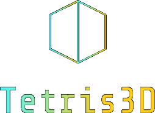
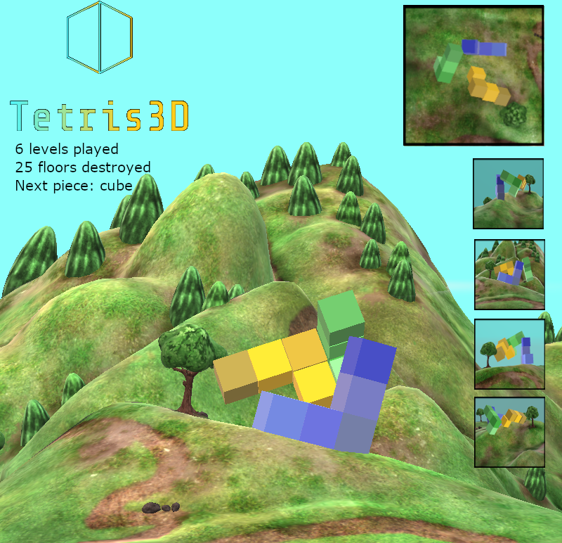

# Tetris 3D

Group III's project for SWE 6733 in Spring 2024.
## Team

* Julian Hall [Product owner]
* Edmond-Aimé Kabushemeye Nkinzo [Scrum master]
* Dinesh Sekar
* Christopher Cabrera

## The game

### Trivia

Tetris is a classic and iconic puzzle video game that was created by Alexey Pajitnov in 1984. The game's name is derived from the combination of the Greek word "tetra," meaning four, and "tennis," which was Pajitnov's favorite sport. Tetris was  a popular game even before it was commercialized as many people had acquired copies on floppy disks before it was ever introduced to consoles such as the GameBoy. 

### How to win

The goal of the game is to beat each level by triggering floor  (horizontal slice of the arena without holes) destructions. Once a floor is full, it is destroyed and let any blocks above descend to either land or to the next block below them.

Points are awarded for each floor destruction and even more for the destruction of multiple floor with a single block.

### Original Rules

 Tetris 2D revolves around manipulating falling tetrominoes—geometric shapes composed of four square blocks. The tetrominoes come in seven different shapes, each distinct and composed of varying arrangements of squares. As they descend from the top of the playing field, the player must rotate and move the falling tetrominoes to create complete horizontal lines without any gaps.

## Vision

### Near term

* Re-imagined game: Tetris 3D does not just add a third dimension to the blocks, it also adds it to the arena. It takes the game and creates a world around it. Now you can view the blocks from all angles and rotate pieces around new axes. 

* New mechanics: Tetris 3D adds new mechanics to the game by allowing movements that were either trivial or inconsequential in two dimensions but that change the game's dynamic and difficulty by allowing blocks and the floors to move in three dimensions.

* Simple fun: Tetris 3D is a timeless and fun experience that can be played for days without repetition. It is the perfect pass-time: simple, fun, create. 

### Long term

* New shapes: Tetris 3D will have new shapes that take advantage of the third dimension to create new challenges, new levels, and new experiences.

* Immersive and dynamic environments: Tetris 3D will provide an immersive environments surrounding the arena, with uncountable combinations that vary with the time of day, local weather, local holidays, and more.

* Compatibility and portability: Tetris 3D will be playable on all consoles, laptops and desktops. It will be available for download on all game streaming and mobile game platforms.

* Multiplayer Mode: Tetris 3D will have a turn-base multi-player mode.

* Modularity:Tetris 3D will allow custom modifications to change the music, the map, the effects, and animations in the game.

### Unique Experience

By remastering the game we are also bringing a new and unique experience:

* The three-dimensional experience will allow players to view the arena and the blocks from multiple angles.
* A new move will be added to allow players to rotate a floor by increments of 90 degrees (90, 180, 270).

## Project tasks

Here is a [link](https://trello.com/b/gGyl378S/spring-2024-swe-6733) to our Kanban board on trello.

We are using t-shirt sizes and number effort estimations:
* Extra-Small or 1
* Small or 2
* Medium or 3
* Large or 5
* Extra-Large or 8

We have divided tasks into stories (using labels in Trello):
* Game Experience
  * Anything that pertains to how player will experience the game.
* Game Level
  * Anything that pertains to how each game level will be setup.
* Game difficulty
  * Anything that pertains to how hard it will be to play the game

There is also an additional story for course deliverable.

We have set two levels of priorities:
* Required (for the course's deliverables)
* Nice to have (in case we have extra time or decide to continue development even after the course)

Tasks have been ordered in organic way allowing the game to gain more useful features and by placing dependencies first (like the terrain and sky before trying to move pieces in the game).

## Initial mock game play screenshots

